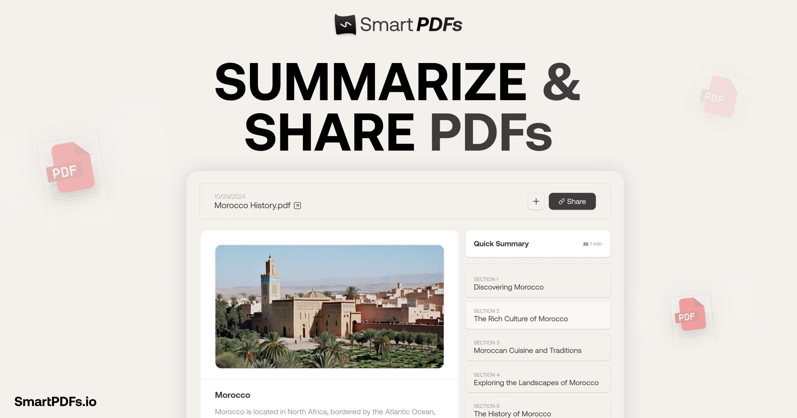

<a href="https://github.com/Nutlope/smartpdfs">
  
  <h1 align="center">SmartPDF</h1>
</a>

  Instantly summarize and section your PDFs with AI. Powered by DeepSeek V4 Flash on Together AI.

## Tech stack

- [Together AI](https://togetherai.link/?utm_source=smartpdfs&utm_medium=referral&utm_campaign=example-app) for inference
- DeepSeek V4 Flash for PDF summaries
- Next.js with Tailwind & TypeScript
- Prisma ORM with Neon (Postgres)
- Braintrust for privacy-safe inference observability
- Plausible for analytics
- Direct browser-to-S3 presigned uploads for PDF storage

## Cloning & running

1. Clone the repo: `git clone https://github.com/Nutlope/smartpdfs`
2. Create a `.env` file and add your environment variables (see `.example.env`):
   - `TOGETHER_API_KEY=`
   - `BRAINTRUST_API_KEY=` (optional, for observability)
   - `BRAINTRUST_PROJECT=smartpdfs`
   - `DATABASE_URL=`
   - `S3_UPLOAD_KEY=`
   - `S3_UPLOAD_SECRET=`
   - `S3_UPLOAD_BUCKET=`
   - `S3_UPLOAD_REGION=us-east-1`
3. Run `pnpm install` to install dependencies
4. Run `pnpm prisma generate` to generate the Prisma client
5. Run `pnpm dev` to start the development server

## Roadmap

- [ ] Add some rate limiting by IP address
- [ ] Integrate OCR for image parsing in PDFs
- [ ] Add a bit more polish (make the link icon nicer) & add a "powered by Together" sign
- [ ] Implement additional revision steps for improved summaries
- [ ] Add a demo PDF for new users to be able to see it in action
- [ ] Add feedback system with thumbs up/down feature
